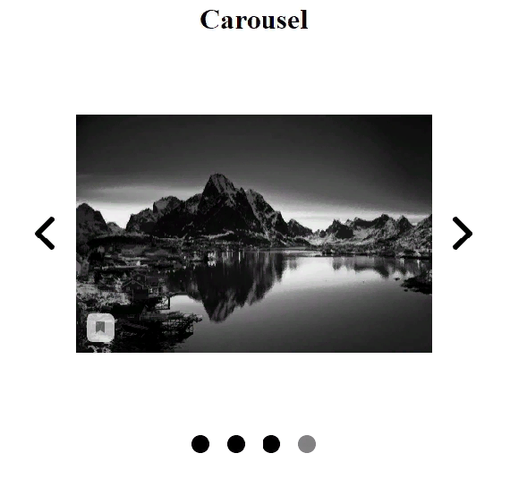
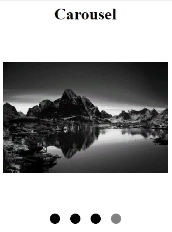

# Carousel

This Carousel Component is made both for desktop and mobile devices and support any html content.

To upload the content to the Carousel, you need to create JSX elements in 'src/content/content.js'
file and push them into the data array, which is also located in this file.

```js
const pic1 = 
const pic2 = 
const pic3 = 
const text = <p>Some text</p>

const data = [pic1, text, pic2, pic3];
```

You can stylize elements in 'src/content/styles.js' file.

```js
export const Img = styled.img`
  width: 100%;
  height: auto;
`
```

Then data is used as the prop 'data' in the Carousel component.

```js
<Carousel data={data} size='400' />
```

There is also prop 'size' in the Carousel. This is the width and the height of the Carousel
element in px. It applies only for desktop devices. For mobile, it's always 100% of screen width.

To go to the next and the previous elements on desktop devices there are corresponding buttons.
On mobile devices there are no buttons, you need to use slides to change the element.
There are also scroll points at the bottom of the Carousel. You can go to any element by clicking
on the appropriate point.

## Desktop view:




## Mobile view:




